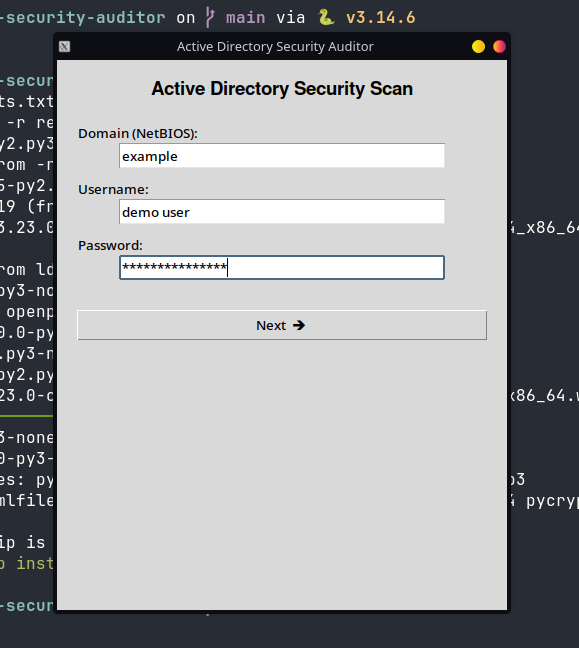
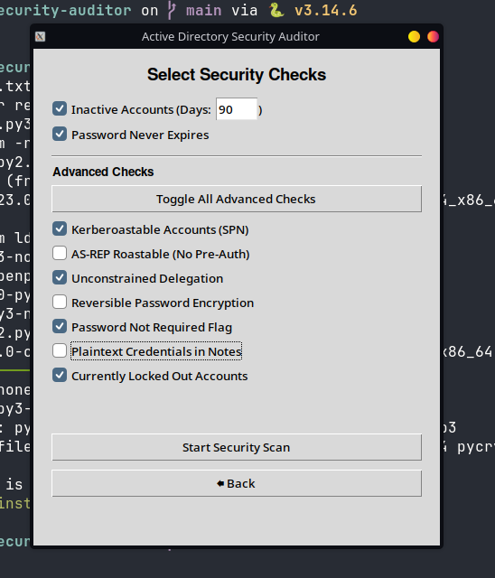
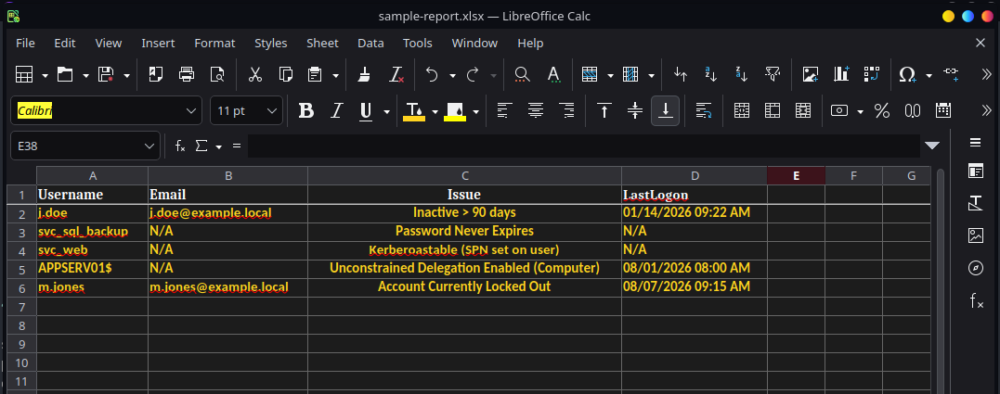

# Enterprise Active Directory Security Auditor

> Python desktop application for demonstrating Active Directory security assessment workflows and structured security reporting.

> **Portfolio Edition:** This repository contains a sanitized version of an application developed during my IT security internship. Proprietary detection logic, infrastructure details, and organizational data have been removed while preserving the application's architecture, workflow, and reporting pipeline.

---

## Overview

Enterprise Active Directory Security Auditor is a Python desktop application designed to streamline common Active Directory identity security assessment workflows.

The original application was designed to authenticate to Active Directory, perform configurable security assessments, collect findings, and generate Excel reports.

The public portfolio edition uses **Portfolio Mode** and representative demonstration data instead of the original proprietary detection logic, allowing the application to be safely demonstrated without access to an enterprise environment.

---

## Features

- Active Directory/LDAP/NTLM authentication architecture
- Tkinter desktop GUI
- Configurable security assessment options
- Inactive account and password security reviews
- Identity and authentication security assessment workflows
- Background scan execution with threading
- Structured finding collection
- Automated Excel report generation
- Configuration file support
- Portfolio Mode for safe demonstration

---

## Security Assessment Categories

The portfolio edition demonstrates workflows for:

- Inactive accounts
- Password expiration
- Service account security
- Authentication configuration
- Delegation configuration
- Account lockout

The original enterprise implementation contained additional organization-specific detection logic that has been removed from this repository.

---

## Technologies

- Python 3
- Tkinter
- ldap3
- LDAP / NTLM
- OpenPyXL
- Threading
- ConfigParser
- Microsoft Active Directory

---

## Screenshots

### Application



### Security Assessments



### Example Report



---

## Project Structure

```text
.
├── ad_security_auditor.py
├── config.ini.example
├── requirements.txt
├── README.md
├── LICENSE
├── .gitignore
└── screenshots/
    ├── login.png
    ├── security-checks.png
    └── sample-report.png
```

---

## Configuration

Copy config.ini.example to config.ini for local configuration.

The example uses fictional infrastructure values:

[Settings]
LdapServer = dc01.example.local
DirectoryBase = DC=example,DC=local
DefaultInactiveDays = 90
DefaultNtlmDomain = EXAMPLE

CheckKerberoastable = False
CheckASREPRoastable = False
CheckUnconstrainedDelegation = False
CheckReversibleEncryption = False
CheckPasswordNotRequired = False
CheckPlaintextInNotes = False
CheckLockedOut = False

When PORTFOLIO_MODE is enabled, the application uses demonstration data instead of connecting to Active Directory.

---

## Report Output

The application generates an Excel report containing:

Username
Email
Security Finding
Last Logon

All findings in the public portfolio edition are fictional demonstration data.

---

## Skills Demonstrated

Cybersecurity: Active Directory, Identity Security, IAM, security automation, defensive security

Development: Python, GUI development, LDAP/NTLM integration, multithreading, configuration management, Excel reporting

## Security & Privacy

---

This repository has been sanitized to remove:

Proprietary detection logic
Internal infrastructure details
Production identities and credentials
Organization-specific configuration

The public version is intended for portfolio and educational demonstration purposes.

---

## Author

Suriyah Saravanan

Management Information Systems - Cybersecurity
